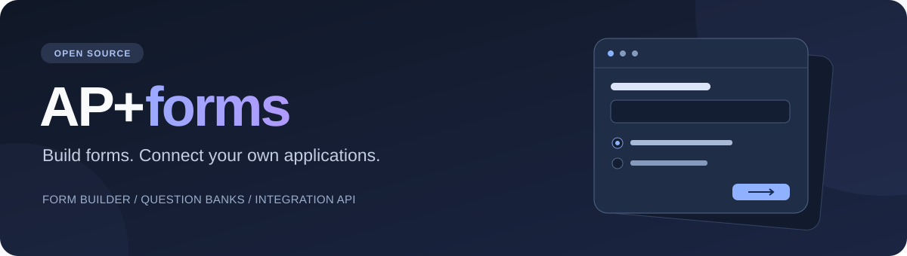

<p align="center">
  
</p>

<p align="center">
  <a href="LICENSE"></a>
  
  
  <a href="https://github.com/Yamada078/AP-Forms-Template/actions/workflows/check.yml"></a>
</p>

<p align="center">
  <a href="app/docs/deployment.md"><strong>ติดตั้งระบบ</strong></a> ·
  <a href="app/docs/user-guide.md">คู่มือใช้งาน</a> ·
  <a href="app/docs/api-quickstart.md">เชื่อม API</a> ·
  <a href="docs/project.md">ภาพรวมโครงงาน</a>
</p>

# AP+forms

โครงงานโอเพนซอร์สสำหรับสร้างระบบฟอร์ม คลังคำถาม และชุดคำถามในบัญชี Cloudflare ของคุณ พร้อม API สำหรับเชื่อมเว็บ แอปพลิเคชัน และเกม

นำซอร์สไปติดตั้ง ตั้งรหัสทีม และเริ่มสร้างฟอร์มของคุณเองได้ ข้อมูลและการเชื่อมต่อของแต่ละระบบอยู่ในฐานข้อมูลที่เจ้าของระบบสร้าง

สร้างฟอร์ม → เผยแพร่เวอร์ชัน → รับคำตอบหรือเชื่อมแอป → ดูผลในระบบของคุณ

## สิ่งที่ทำได้

| ส่วนของระบบ | ความสามารถ |
| --- | --- |
| **Form Builder** | จัดหน้าและบล็อกคำถาม เพิ่มคำชี้แจงและสื่อ พร้อมตรวจรูปแบบคำตอบ |
| **Logic** | แสดงหรือซ่อนบล็อก เปลี่ยนเส้นทางหน้า และเพิ่มคำถามใต้ตัวเลือก |
| **Publish** | แยกฉบับร่างกับฉบับเผยแพร่ ใช้ลิงก์ถาวร ตั้งเวลาเปิด–ปิด และเก็บเวอร์ชัน |
| **Responses** | ดูรายการ สรุปคำตอบ และแยกตามเวอร์ชันหรือแหล่งที่มา |
| **Question Studio** | จัดคลังและแท็ก รองรับคำถาม 7 รูปแบบ รวมถึงจับคู่ เรียงลำดับ และลากวาง |
| **Question Packs** | เลือกคำถามหรือสุ่มตามเงื่อนไข แล้วเผยแพร่ชุดที่คงคำถามไว้ตามเวอร์ชัน |
| **Integration API** | ให้แต่ละแอปอ่านฟอร์ม ส่งคำตอบ อ่านชุดคำถาม และตรวจคำตอบตามสิทธิ์ที่กำหนด |

## เริ่มทดลองบนเครื่อง

ติดตั้ง Node.js 24 ขึ้นไป เลือก **Use this template** บน GitHub เพื่อสร้าง repository ของคุณ หรือดาวน์โหลดซอร์ส หากต้องการลองจากซอร์สต้นฉบับ:

```powershell
git clone https://github.com/Yamada078/AP-Forms-Template.git
cd AP-Forms-Template
cd app
npm ci
npm run key:local
npm run db:setup:local
npm run dev
```

เปิด URL ที่ terminal แสดง ใช้รหัสทีมจากไฟล์ `.dev.vars` ที่สร้างบนเครื่องเข้าสู่ Builder ขั้นตอนสร้างตารางใช้กับฐานข้อมูล local ที่ยังว่างครั้งแรก

เมื่อต้องการเปิดเว็บให้ผู้ตอบใช้งาน ทำตาม [คู่มือติดตั้งบน Cloudflare](app/docs/deployment.md) เพื่อสร้างฐานข้อมูลของคุณ ตั้ง Secrets และ deploy

## เชื่อมต่อกับแอปของคุณ

สร้าง Application เลือก permissions และฟอร์มหรือชุดคำถามที่อนุญาต จากนั้นสร้างรหัสเชื่อมต่อสำหรับเซิร์ฟเวอร์ของแอป

- อ่านฟอร์ม: `GET /api/integrations/forms/{publicId}/schema`
- ส่งคำตอบ: `POST /api/integrations/forms/{publicId}/responses`
- อ่านชุดคำถาม: `GET /api/integrations/question-packs/{packId}`
- ตรวจคำตอบชุดคำถาม: `POST /api/integrations/question-packs/{packId}/grade`

เริ่มจาก [ตัวอย่าง API](app/docs/api-quickstart.md) แล้วดู [สิทธิ์และเส้นทาง API](app/docs/integration.md) เพิ่มเติม

## เหมาะกับงานแบบไหน

- แบบฟอร์มหรือแบบสอบถามที่ต้องมีเงื่อนไขและเส้นทางหลายหน้า
- โครงงานที่ต้องการคลังคำถามและชุดคำถามนำกลับมาใช้
- เว็บหรือเกมที่ต้องอ่านคำถามและส่งคำตอบผ่าน API
- ผู้พัฒนาที่ต้องการศึกษาหรือปรับระบบฟอร์มภายใต้ MIT License

## โครงสร้าง

```text
AP-Forms-Template/
├── README.md
├── LICENSE
├── CONTRIBUTING.md
├── docs/                 ภาพประกอบและภาพรวมโครงงาน
├── examples/             ตัวอย่างสำหรับผู้เชื่อม API
└── app/
    ├── src/              Worker และ API
    ├── public/           หน้าเว็บและสื่อประกอบ
    ├── database/         โครงสร้างฐานข้อมูลใหม่
    ├── migrations/       การปรับโครงสร้างฐานข้อมูล
    ├── scripts/          เครื่องมือสำหรับผู้ติดตั้งและผู้พัฒนา
    ├── tests/            ชุดทดสอบ
    └── wrangler.jsonc    ค่าตั้งค่าตัวอย่าง
```

## คู่มือเพิ่มเติม

- [เป้าหมายและภาพรวมโครงงาน](docs/project.md)
- [การพัฒนาและตรวจสอบระบบ](app/docs/development.md)
- [สื่อตกแต่งฟอร์ม](app/public/assets/README.md)
- [รูปประกอบคำถาม](app/public/assets/question-media/README.md)
- [บันทึกการเปลี่ยนแปลง](app/CHANGELOG.md)

## ขอบเขตปัจจุบัน

ระบบใช้ `TEAM_KEY` สำหรับผู้ดูแลทีม ยังไม่มีบัญชีส่วนตัวและการกำหนดสิทธิ์ผู้ดูแลรายบุคคล หน้าเว็บใช้ภาษาไทยเป็นหลัก การเพิ่มไฟล์สื่อทำผ่านซอร์สในโปรเจกต์ ส่วนการเผยแพร่รองรับ Cloudflare Workers และ D1 ตามคู่มือ

<details>
<summary><strong>คำถามก่อนติดตั้ง</strong></summary>

**ใช้ฐานข้อมูลของใคร?** แต่ละระบบสร้าง D1 ในบัญชีของตน แล้วเปลี่ยนค่าใน `app/wrangler.jsonc` ตามคู่มือติดตั้ง

**มีฟอร์มหรือรหัสพร้อมใช้ไหม?** ซอร์สมีแม่แบบคำถามสำหรับทดลอง ผู้ติดตั้งสร้างฟอร์ม รหัสทีม และรหัสเชื่อมต่อเอง

**แก้หน้าตาและ API ได้ไหม?** ได้ โค้ดหน้าเว็บอยู่ใน `app/public` และ Worker อยู่ใน `app/src` ดูขั้นตอนใน [คู่มือพัฒนา](app/docs/development.md)

**ช่วยพัฒนาได้อย่างไร?** แจ้งปัญหาหรือเสนอ pull request โดยเริ่มจาก [แนวทางร่วมพัฒนา](CONTRIBUTING.md)

</details>

## ใบอนุญาต

เผยแพร่ภายใต้ [MIT License](LICENSE) สามารถใช้ ดัดแปลง และแจกต่อได้ โดยคงข้อความลิขสิทธิ์และใบอนุญาตไว้
