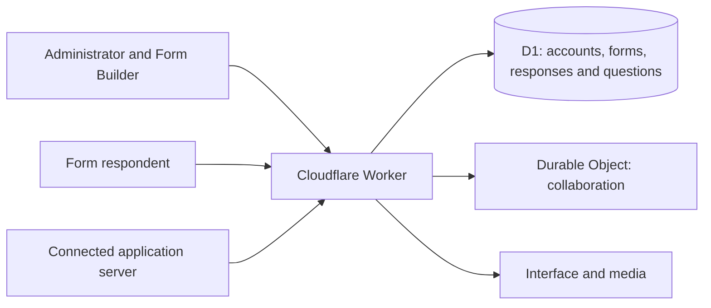

**English** · [ภาษาไทย](../project.md)

# Project overview

AP+forms combines a form workspace, reusable question content and an application API in source that each organization can install and adapt.

## Goals

- Design forms with conditional blocks and page routing.
- Organize questions into reusable banks and packs.
- Keep drafts separate from published versions so responses can be read against the version used.
- Give external applications access only to authorized forms and question packs.
- Provide source and installation guides so each owner controls their own system and data.

## Components

The interface uses HTML, CSS and JavaScript. APIs run in the Worker, D1 stores each installation's data, and a Durable Object coordinates collaborative form editing.

English and Thai interface text share one language catalog. The system translates its own controls while preserving authored form content and responses.

## Independent installations

Each owner creates a Worker and database in their own account, sets up the first administrator, invites members and creates integration keys. The distribution includes a database schema and question examples rather than data or credentials from a running organization.

Use it as a project, a way to study form system design, or a starting point for applications that need questions and responses through an API.

## Further development

Possible extensions include existing organizational sign-in, department-specific permissions, support for other hosting platforms, additional languages and changes to the respondent experience. See the [project home](../../README.md) for current scope.

[Install](../../app/docs/en/deployment.md) · [Contribute](../../CONTRIBUTING.md)
