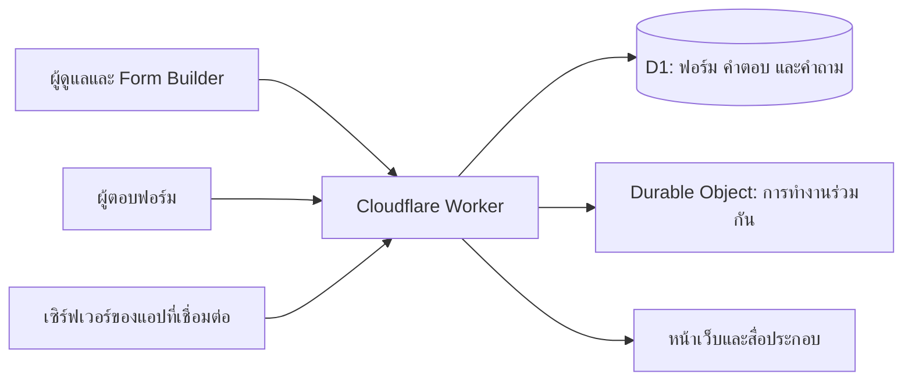

# ภาพรวมโครงงาน AP+forms

AP+forms พัฒนาขึ้นเพื่อรวมการสร้างฟอร์ม การจัดคำถาม และการเชื่อมต่อแอปไว้ในซอร์สที่เจ้าของระบบติดตั้งและปรับต่อได้

## เป้าหมาย

- ออกแบบฟอร์มที่มีเงื่อนไขและเส้นทางการตอบได้
- เก็บคำถามไว้ในคลังและจัดเป็นชุดนำกลับมาใช้
- แยกฉบับร่างจากฉบับเผยแพร่ เพื่ออ่านคำตอบตามเวอร์ชันที่ใช้งาน
- ให้แอปภายนอกเข้าถึงเฉพาะฟอร์มและชุดคำถามที่ได้รับอนุญาต
- แจกซอร์สและวิธีติดตั้ง เพื่อให้แต่ละคนดูแลระบบและข้อมูลของตัวเอง

## ส่วนประกอบ

หน้าเว็บใช้ HTML, CSS และ JavaScript ส่วน API อยู่ใน Worker ฐานข้อมูล D1 เก็บข้อมูลแต่ละระบบ และ Durable Object ช่วยประสานการแก้ไขฟอร์มระหว่างสมาชิก

## การติดตั้งแต่ละระบบ

เจ้าของระบบสร้าง Worker และฐานข้อมูลในบัญชีของตน ตั้งผู้ดูแลคนแรก เชิญสมาชิก และสร้างรหัสเชื่อมต่อใหม่ ตัวแจกมีโครงสร้างตารางกับตัวอย่างคำถาม โดยไม่รวมฟอร์มหรือคำตอบจากระบบที่ใช้งานจริง

แนวทางนี้เหมาะสำหรับใช้เป็นโครงงาน ศึกษาการออกแบบระบบฟอร์ม หรือนำไปปรับกับเว็บและแอปที่ต้องการคำถามกับคำตอบผ่าน API

## การพัฒนาต่อ

แนวทางที่สามารถต่อยอดได้ ได้แก่ การเชื่อมบัญชีองค์กรเดิม การแยกสิทธิ์รายแผนก การรองรับโฮสต์อื่น การเพิ่มภาษา และการปรับประสบการณ์ผู้ใช้ตามลักษณะฟอร์ม ขอบเขตปัจจุบันอยู่ใน [หน้าแรก](../README.md)

[ติดตั้งระบบ](../app/docs/deployment.md) · [ร่วมพัฒนา](../CONTRIBUTING.md)
